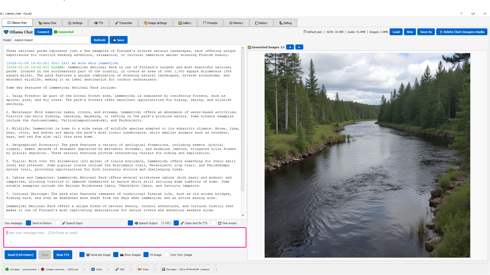
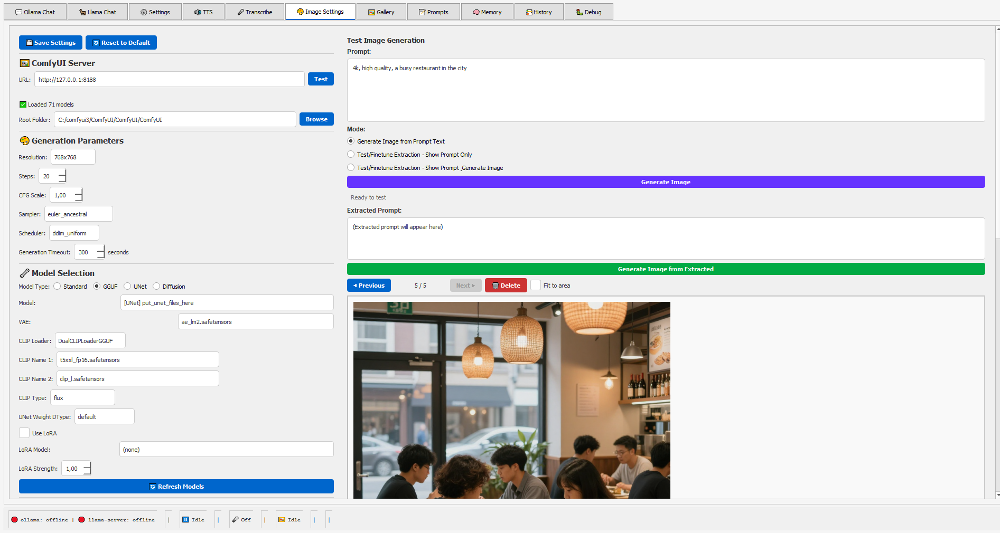
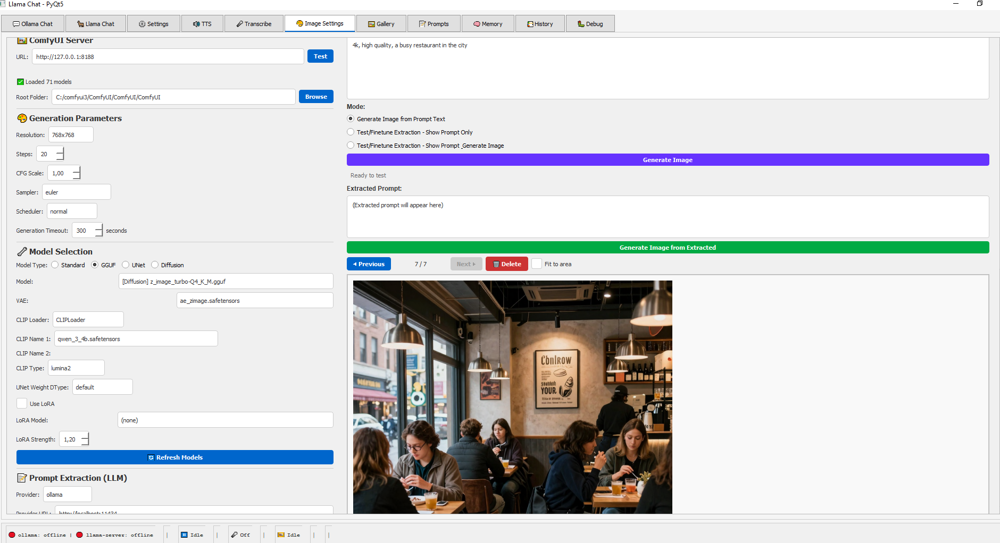
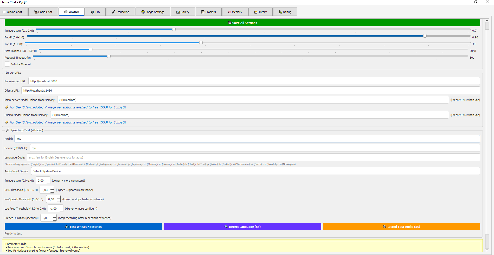
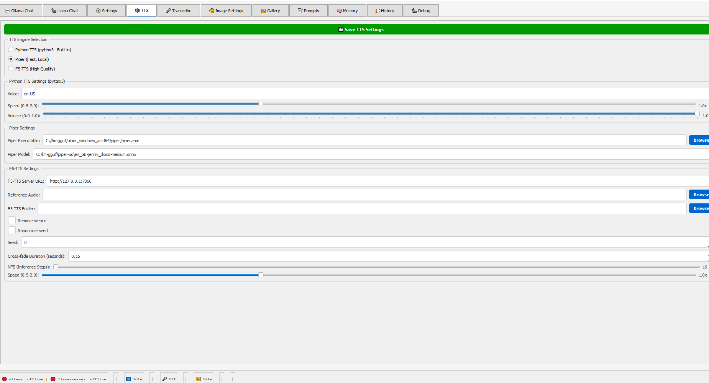

# Llama Chat GUI - PyQt5

I created this app during my vacation in December, and when I returned to work in January, I didn't have much spare time. I kept adding features and fixing bugs. Then LTX2 came out and I became more interested in it. I wanted to bring ComfyUI image generation and F5-TTS. The chat functionality was the hardest part—the only approach I found to implement memory of previous conversations was using embeddings like Nomic Embed Text 1.5 with custom keywords. Some LLM models don't follow the system prompt, so it doesn't work every time. I'm sure there are some bugs since I'm the only one testing this app. For ComfyUI image generation, any model that works inside ComfyUI should work, and with LoRA models I've only tested Flux 1 Dev, which works well.

Will this chat work as well as other chat apps? Most likely not—I'm no expert. I just wanted to bring all the different parts together.

Note: F5-TTS and ComfyUI both need to be running in the background.

**F5-TTS Installation Note:** F5-TTS requires additional dependencies not included in requirements.txt. You can manually install it later if you plan to use F5-TTS.

**Speech-to-Text Tips:** Whisper may detect words incorrectly if your microphone volume is too low. You can test audio input quality by recording test audio and comparing it to other audio files for reference.

I use an old Intel computer with RTX 5070 Ti 16GB VRAM and 64 GB system RAM. When using this app, it uses up to 35 GB RAM and about 14-15 GB VRAM. That's the total system memory usage including Windows and other applications, not just this app.

This app was created by Claude Haiku. I have no programming experience—the rest of this README was written by Claude.

A feature-rich desktop chat application with support for **Ollama** and **Llama-Server**, **text-to-speech (TTS)**, **speech-to-text (STT)**, and **AI image generation**.





## 🔗 Links & Resources

- **[Ollama](https://ollama.ai)** - Fast, offline LLM execution
- **[Llama.cpp](https://github.com/ggerganov/llama.cpp)** - Efficient GGUF model inference (llama-server)
- **[OpenAI Whisper](https://github.com/openai/whisper)** - Speech-to-text transcription
- **[Piper TTS](https://github.com/rhasspy/piper)** - Fast neural text-to-speech
- **[F5-TTS](https://github.com/SWivid/F5-TTS)** - Advanced text-to-speech
- **[ComfyUI](https://github.com/comfyanonymous/ComfyUI)** - Image generation node interface
- **[PyQt5](https://www.riverbankcomputing.com/software/pyqt/)** - GUI framework

## Features

### 💬 Multi-Server Chat
- **Ollama Support**: Connect to local Ollama server for fast local LLM inference
- **Llama-Server Support**: Alternative llama-server implementation for flexible model loading
- **Real-time Streaming**: Stream responses token-by-token for immediate feedback
- **Chat History**: Persistent conversation memory with save/load functionality
- **Context Management**: Conversation memory with vector embeddings for intelligent context

### 🎤 Voice & Audio Features
- **Speech-to-Text (STT)**: Real-time voice input using OpenAI Whisper
- **Text-to-Speech (TTS)**: Convert AI responses to natural speech
- **Audio Playback**: Built-in audio player with pygame
- **Multi-device Support**: Configure input/output audio devices

### 🖼️ AI Image Generation
- **ComfyUI Integration**: Generate images from text prompts
- **Image Gallery**: Browse and manage generated images
- **Prompt Extraction**: Automatically extract image generation prompts from chat
- **Advanced Settings**: Customize model, sampler, and generation parameters



### ⚙️ Customization
- **System Prompts**: Define custom system prompts for chat behavior
- **Chat Templates**: Template system for consistent message formatting
- **Prompt Profiles**: Save and manage different prompt configurations
- **Settings Management**: Comprehensive configuration interface



### 🔊 Advanced TTS Options
- Multiple TTS engine support
- Adjustable speech rate and voice selection
- Voice profile management



## Installation

### Prerequisites
- Python 3.8+
- Ollama or Llama-Server (for chat functionality)
- ComfyUI (optional, for image generation)

### Setup Steps

1. **Clone and navigate to the project:**
   ```bash
   cd chat-llama-gui2
   ```

2. **Create a virtual environment:**
   ```bash
   python -m venv venv
   source venv/bin/activate  # On Windows: venv\Scripts\activate
   ```

3. **Install dependencies:**
   ```bash
   pip install -r requirements.txt
   ```

4. **Run the application:**
   ```bash
   python main_qt.py
   ```

## Configuration

### Initial Setup

On first run, configure your servers:

1. **Ollama Server**
   - Default URL: `http://localhost:11434`
   - Go to Settings → Server Settings to change

2. **Llama-Server**
   - Default URL: `http://127.0.0.1:8080`
   - Configure in Settings → Server Settings

3. **ComfyUI (Optional)**
   - Default URL: `http://127.0.0.1:8188`
   - Required only for image generation
   - Configure root folder in Settings → Image Settings

### Audio Devices

1. Go to Settings → Audio Settings
2. Select your preferred input/output devices
3. Adjust microphone sensitivity (RMS threshold)

### Custom System Prompts

1. Open "System Prompts & Templates" tab
2. Edit prompts for Ollama and Llama-Server separately
3. Changes save automatically

## Usage

### Basic Chat

1. **Select Server & Model**
   - Use tabs to switch between Ollama and Llama-Server
   - Click "Connect" to establish connection
   - Select model from dropdown

2. **Send Messages**
   - Type in the input area
   - Press Enter (or click Send) to submit
   - Responses stream in real-time

3. **Voice Features**
   - Click 🎤 button to start voice input
   - Speak naturally; speech auto-converts to text
   - AI responses auto-play if TTS is enabled

### Generate Images

1. Go to Image Settings tab
2. Configure model, sampler, and parameters
3. In chat, add special prompt like: `[IMAGE]` or mention image generation
4. Images appear in the Image Gallery

### Chat History

- Automatic saving to `saved_chats_ollama/` or `saved_chats_llama_server/`
- Browse conversations in History tab
- Export/import chat sessions

## Requirements

Core dependencies:
- **PyQt5** - Modern desktop GUI framework
- **requests** - HTTP communication with servers
- **openai-whisper** - Speech-to-text
- **pygame** - Audio playback
- **Pillow** - Image processing
- **sounddevice/soundfile** - Audio I/O
- **python-dotenv** - Environment configuration
- **psutil** - System monitoring

See `requirements.txt` for complete list and versions.

## Project Structure

```
chat-llama-gui2/
├── main_qt.py                 # Main application entry point
├── qt_tabs/                   # Qt-based tab implementations
│   ├── qt_chat_tab.py        # Chat tab base
│   ├── qt_ollama_chat_tab.py  # Ollama-specific chat
│   ├── qt_llama_chat_tab.py   # Llama-Server-specific chat
│   ├── qt_image_settings_tab.py
│   ├── qt_tts_tab.py         # Text-to-speech configuration
│   ├── qt_settings_tab.py    # General settings
│   └── ...
├── llama_client.py           # Llama-Server API client
├── ollama_client.py          # Ollama API client
├── chat_manager.py           # Chat history management
├── conversation_memory.py    # Context/embedding management
├── speech_to_text.py         # Whisper STT wrapper
├── tts_manager.py            # Text-to-speech management
├── image_client.py           # ComfyUI image generation
└── saved_chats_*/           # Persistent chat history
```

## Keyboard Shortcuts

- **Enter**: Send message (when configured)
- **Shift+Enter**: New line in input
- **Ctrl+Tab**: Switch between chat tabs

## Troubleshooting

### Connection Issues

**"Cannot reach server"**
- Verify Ollama/Llama-Server is running
- Check URLs in Settings → Server Settings
- Ensure no firewall blocking ports (11434 for Ollama, 8080 for Llama)

**Connection test runs in background**
- This is normal! Threading prevents UI freeze during network checks
- Signals safely update UI when test completes

### Audio Issues

**No microphone input**
- Go to Settings → Audio Settings
- Select correct input device
- Adjust RMS threshold for sensitivity
- Check `list_audio_devices.py` to debug available devices

**No audio output**
- Select correct output device in Audio Settings
- Check system volume levels
- Verify pygame audio is initialized

### Image Generation

**Images not generating**
- Ensure ComfyUI is running on configured URL
- Check ComfyUI root folder path in settings
- Verify model files are present in ComfyUI

## Development

### Debug Settings

Enable debug output in Settings → Debug Settings:
- Chat debugging
- Connection debugging
- Template formatting debugging
- Image generation debugging

### Key Classes

- `LlamaChatQt` - Main application window
- `OllamaClient` / `LlamaServerClient` - Server communication
- `ChatManager` - History and persistence
- `SpeechToText` - Whisper integration
- `TTSManager` - Text-to-speech
- `ComfyUIClient` - Image generation

## Performance Tips

1. **For faster responses**: Use smaller models (e.g., mistral-7b)
2. **For quality**: Use larger models (e.g., neural-chat, dolphin-mixtral)
3. **GPU acceleration**: Ensure Ollama/Llama-Server use GPU if available
4. **Memory**: Monitor with included system status panel

## License

Created for local AI experimentation and development.

## Support

For issues or features:
1. Check Debug Settings tab for error logs
2. Review console output for detailed error messages
3. Verify server connectivity before reporting issues

## License

This project is provided as-is for local development and experimentation.

### Dependencies Licenses

This project uses several open-source libraries:

- **PyQt5** - GPL v3 / Commercial License
- **Ollama** - MIT License
- **Llama.cpp** - MIT License
- **OpenAI Whisper** - MIT License
- **Piper TTS** - MIT License
- **ComfyUI** - GPL v3 License
- **pygame** - LGPL License
- **requests** - Apache 2.0 License
- **Pillow** - HPND License
- **numpy** - BSD License
- **python-dotenv** - BSD License
- **psutil** - BSD License
- **sounddevice/soundfile** - MIT/BSD Licenses

Please refer to each project's repository for complete license details.

## Acknowledgments

Built with:
- [Ollama](https://ollama.ai) - Local LLM inference
- [Llama.cpp](https://github.com/ggerganov/llama.cpp) - Efficient GGUF model execution
- [OpenAI Whisper](https://github.com/openai/whisper) - State-of-the-art speech recognition
- [Piper](https://github.com/rhasspy/piper) & [F5-TTS](https://github.com/SWivid/F5-TTS) - Neural TTS
- [ComfyUI](https://github.com/comfyanonymous/ComfyUI) - Flexible image generation
- [PyQt5](https://www.riverbankcomputing.com/software/pyqt/) - Modern desktop UI framework

Special thanks to the open-source communities behind these projects!

## Contact

For questions or feedback: **tuonomindcode@bahnhof.se**
